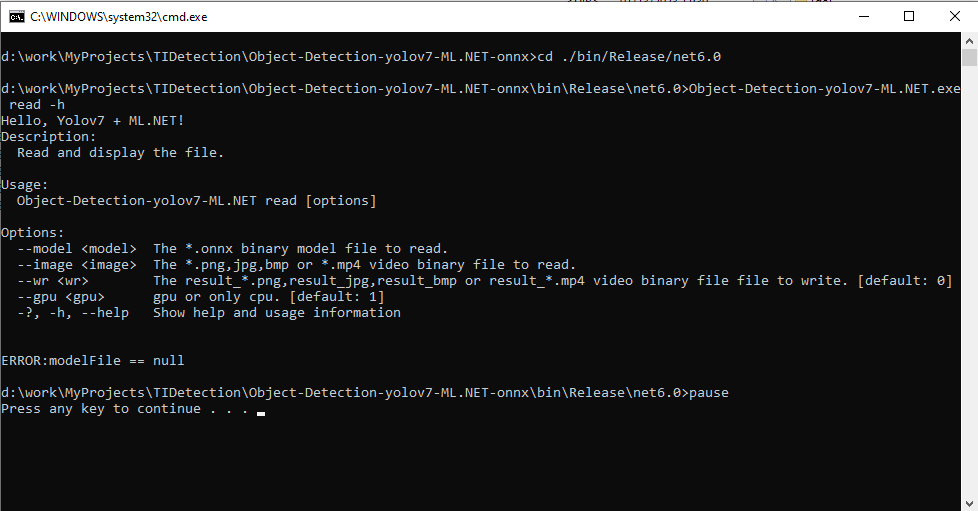
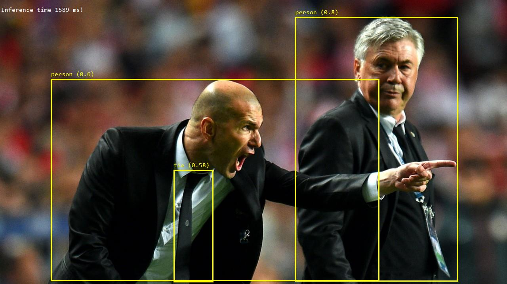

### Object-Detection-Yolov7-ML.NET-onnx
Yolov7 Deep MI Onnx model process with ML.NET machine learning framework, C# in Windows 10.<br>
Base is [Yolov7](https://github.com/WongKinYiu/yolov7)<br>
Onnx model format description: [Open Neural Network Exchange](https://onnx.ai/).<br>
<br>
[ML.NET office](https://dotnet.microsoft.com/en-us/apps/machinelearning-ai/ml-dotnet/)<br>
<br>
[Emgu office](https://emgu.com/wiki/index.php/Main_Page)<br>

## Enviroment
- Windows 10 64-bit<br>
- NVIDIA Geforce GTX 960 2 Gbyte RAM<br>
- Microsoft Visual Studio Community 2022<br>
- [CUDA Toolkit v11.8](https://developer.nvidia.com/cuda-11.0-download-archive?target_os=Windows&target_arch=x86_64&target_version=10&target_type=exelocal):<br>
  c:\Program Files\NVIDIA GPU Computing Toolkit\CUDA\v11.8\ <br>

## Installation <br>   
   Nuget Package :<br> 
    - Yolov5Net, Version="1.0.9 <br> 
    - Microsoft.ML.OnnxRuntime.Gpu,  Version="1.13.1"  <br> 
    - Microsoft.ML.CpuMath, Version="2.0.0"  <br> 
    - Emgu.CV Version="4.6.0.5131"  <br>
    - Emgu.CV.Bitmap Version="4.6.0.5131" <br>
    - Emgu.CV.runtime.mini.windows Version="4.6.0.5131" <br>
    - System.CommandLine Version="2.0.0-beta4.22272.1" <br>
   
## Building the Object-Detection-yolov7-ML.NET VS2022 project
``` shell
-VS2022 started.
-"Open a project or solution".
-in Browse to search the "Object-Detection-yolov7-ML.NET.sln" file, and it open that.
-Build->Build Solution (F7).
Builded in ".\bin\Release\net6.0\Object-Detection-yolov7-ML.NET.exe".
```
## Running the "Object-Detection-yolov7-ML.NET.exe" app.<br>
Program arguments: <br>
<br>
Examples:
Image:<br>
``` shell
Object-Detection-yolov7-ML.NET_image.bat
```
Result image:<br>
<br>
Video:<br>
``` shell
Object-Detection-yolov7-ML.NET_video.bat
```
Result video:<br>
YouTube video (click):<br>
<div align="center">

[](https://www.youtube.com/watch?v=CERbv7F4fdo)

</div><br>

Inference time is 50-100 ms per image.
